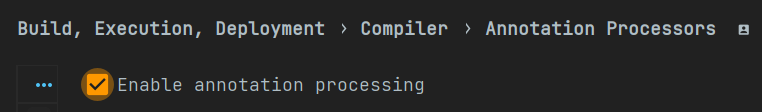
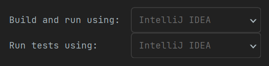

#### 🧩프로젝트 개발 환경 설정

---

##### 라이브러리

의존성 주입 :  web, jpa, lombok, validation, security

###### 1. Lombok

setting : lombok 적용



setting : gradle 대신에 java 로 실행 설정 ( 실행 속도가 더 빠름 )



##### mySQL + JPA 연동

###### 1. 의존성 주입

- mysql-connector-java

- jpa

###### 2. mySQL 환경 설정

1. mysql - root 권한의 new connection 생성

2. mysql - 한글 설정

3. mysql - 사용자 생성 및 권한 주기 및 DB 생성
   
   ```sql
   -- 계정 삭제
   DROP USER 'admin'@'%';
   
   -- 계정 생성
   -- % : 들어오는 모든 ip를 수신
   create user 'admin'@'%' identified by 'ad1212min';
   
   -- ON DB이름.테이블명
   -- TO 유저이름@아이피주소
   GRANT ALL PRIVILEGES ON *.* TO 'admin'@'%';
   CREATE DATABASE shop CHARACTER SET utf8 DEFAULT COLLATE utf8_general_ci;
   use shop;
   
   -- utf8 한글 설정 확인
   show variables like 'c%';
   ```

###### 3. application.yml 설정

1. yml
   
   - xml, json 과 같이 데이터를 교환할 때 사용되는 데이터 형식으로 xml 과 json 에 비해 포맷이 매우 간단
   
   - properties 와 역할은 같지만 형식이 다르므로 중복되는 코드의 양을 줄일 수 있음
   
   - 규칙
     
     - **key** 와 **value** 사이에는 꼭 한 칸의 공백 필요
     
     - 부모-자식 관계의 object 들은 자식 object 앞에 공백 2칸을 붙여 구분
     
     - Array 형식의 경우 `-` 하이픈을 앞에 붙여 구분

2. DB 연동
   
   ```yml
   spring:
     datasource:
       driver-class-name: com.mysql.cj.jdbc.Driver
       url: jdbc:mysql://localhost:(MySQL 포트번호)/(DB 이름름)?serverTimezone=Asia/Seoul
       username: (username)
       password: (password)
   ```

3. JPA 설정
   
   ```yml
   spring:
     jpa:
       hibernate:
         ddl-auto: update
         naming:
           physical-strategy: org.springframework.boot.orm.jpa.hibernate.SpringPhysicalNamingStrategy
         use-new-id-generator-mappings: false
       properties:
         hibernate:
   #        show_sql: true
           format_sql: true
   ```
   
   - `hibernate.ddl-auto` : 서버 시작 시에 DB 에 어떻게 반영할 것인지 설정
     
     - `create` : 서버 시작 시 마다 DB 초기화 = `drop table if exists User` SQL 명령어로 미리 존재하던 테이블 제거 후 생성
     
     - `update` : 수정사항만 DB에 반영 
     
     - `none` : 아무런 반영도 하지 않음
   
   - `hibernate.naming.physical-strategy` : DB 컬럼명 네이밍 전략
     
     - `org.hibernate.boot.model.naming.PhysicalNamingStrategyStandardImpl`
       
       entity 만들 때 클래스 안의 변수명을 그대로 DB 컬럼명으로 사용 ⇒ myEmail
     
     - `org.springframework.boot.orm.jpa.hibernate.SpringPhysicalNamingStrategy`
       
       변수명을 snake case 로 변경하여 사용 ⇒ my_email
   
   - `hibernate.use-new-id-generator-mappings` : PK 값 생성 전략을 JPA 의 기본 생성 전략을 따라갈지 여부 설정
   
   - `hibernate.show_sql` : 실행 시 콘솔창에 (system.out) 실행된 sql 문을 남김
     
     - 참고 : 모든 로그 출력은 가급적 logger 를 통해 남겨야함 → 사용 권장하지 않음
   
   - `hibernate.format_sql` : sql 문의 정렬 여부 설정

4. logger 설정
   
   ```yml
   logging:
     level:
       org.hibernate.SQL: debug
   ```
   
   - `org.hibernate.SQL` : 
     
     - `debug` : hibernate SQL 모든 로그를 디버그 모드로 사용함. 즉, 실행 SQL 을 모두 logger 에 남김

5. ㅇㄹㅇㄹ
